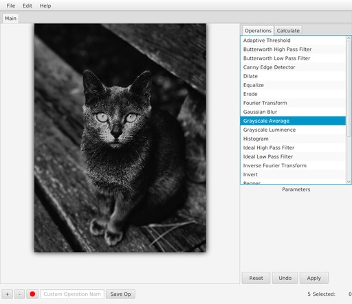
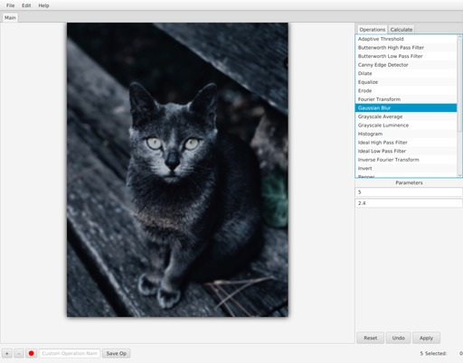
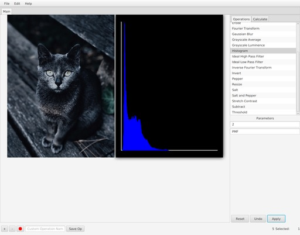
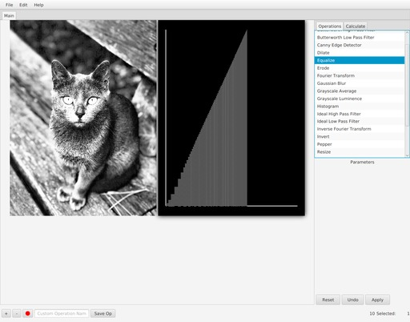
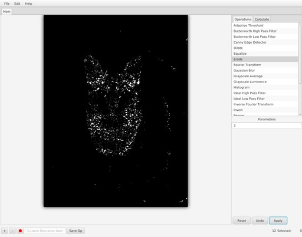

# Image Processor

This is an image processing GUI that can apply various image processing operations to images. 

## Languages/Tools Used

- Java
- JavaFX
- Eclipse
- SceneBuilder

## Screenshots

#### Converting to grayscale:

#### Applying Guassian blur:

#### Generating blue-band histogram:

#### Generating Cumulative Distribution Function after equalizing the image:

#### Performing morphological transformations after applying a threshold:

